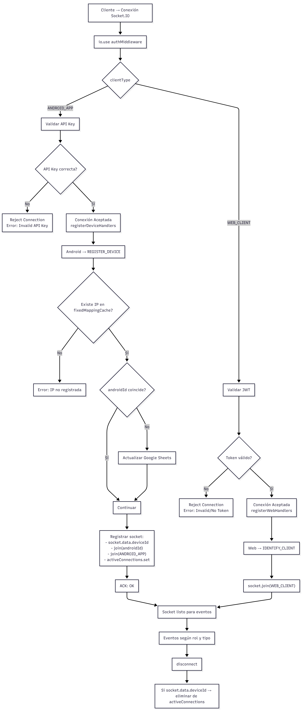

# 📘 Documentación — Arquitectura Web + Android (Socket.IO)

## 1. Descripción General

Este sistema utiliza Socket.IO para comunicar:

- **Clientes Web** → autenticados con **JWT**
- **Clientes Android** → autenticados con **API Key**
- Manejo separado de lógica, seguridad, rooms y eventos.
- Uso de un evento inicial distinto para cada tipo de cliente:

  - Web → `IDENTIFY_CLIENT`
  - Android → `REGISTER_DEVICE`

La arquitectura está diseñada para ser *simple, robusta y tradicional*, manteniendo la autenticación en el **handshake** y la lógica de identificación dentro de los eventos iniciales.

* * *

## 2. Flujo General (Diagrama Mermaid)



## 3. Validación y Autenticación (Handshake)

Toda conexión pasa obligatoriamente por `io.use(socketAuthMiddleware)`.

WEB_CLIENT

- Envía el token vía:

    ```JavaScript
        io.connect(SOCKET_URL, {
        auth: { token }

        });
    ```

- Middleware valida:

  - existencia del token
  - firma JWT
  - si el usuario existe en DB

Si falla: conexión rechazada.

## 4. Identificación del Cliente (post-handshake)

### ✔ **WEB**

Después de ser autenticado, Web envía:

```JavaScript
    socket.emit("IDENTIFY_CLIENT", { clientType: "WEB" });
```

Y el servidor:

- lo mete a la room `WEB_CLIENT`
- habilita handlers exclusivos para Web

* * *

### ✔ **ANDROID**

Android no usa `IDENTIFY_CLIENT`.

El primer evento obligatorio es:

```JavaScript
    socket.emit("REGISTER_DEVICE", { androidId, ipAddress});
```

El servidor:

1. Valida IP → `fixedMappingCache`
2. Actualiza Google Sheets si cambió el androidId
3. Registra el socket:

    - `socket.data.deviceId = androidId`
    - rooms:

        - `ANDROID_APP`
        - room privada del `androidId`
    - guarda conexión en `activeConnections`

* * *

## 5. Rooms Utilizadas

| Room | Uso |
| --- | --- |
| `WEB_CLIENT` | Agrupa todos los paneles web |
| `ANDROID_APP` | Agrupa todos los dispositivos móviles |
| `<androidId>` | Comunicación privada con un solo dispositivo |

* * *

## 6. Eventos según tipo de cliente

### ✔ Web (requiere usuario en `socket.currentUser`)

- `SEND_MESSAGE`
- `SEND_PING`
- `GET_DEVICE_INFO`
- `CHECK_FOR_UPDATE` *(solo admin)*
- `SEND_ALL_MESSAGE` *(solo admin)*  
etc.

* * *

### ✔ Android (requiere deviceId registrado)

- `UPDATE_STATUS`
- `ALARM`
- `HEARTBEAT`
- otros eventos móviles

* * *

## 7. Desconexión

Cuando un dispositivo móvil se desconecta:

```JavaScript
    if (socket.data.deviceId) { 
        activeConnections.delete(socket.data.deviceId);
     }
```

Esto evita que mensajes o acciones se intenten enviar a un socket inexistente.

* * *

## 8. Conclusión del Diseño

- La autenticación está **donde debe estar** → handshake.
- Android y Web tienen rutas de eventos totalmente separadas.
- Web usa `IDENTIFY_CLIENT` solo para organización.
- Android usa `REGISTER_DEVICE` porque requiere lógica especial (Google Sheets, cache, rooms).
- El sistema es seguro, ordenado y escalable.

* * *
